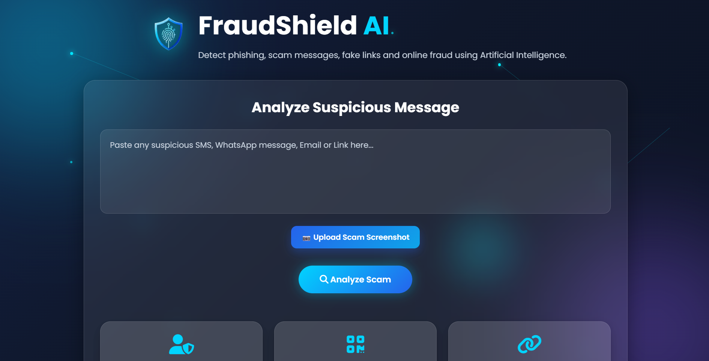
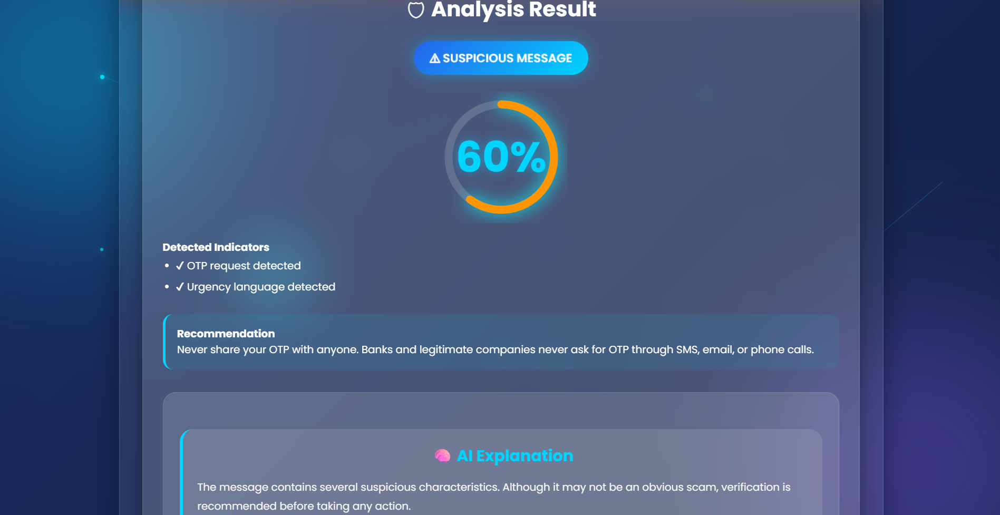
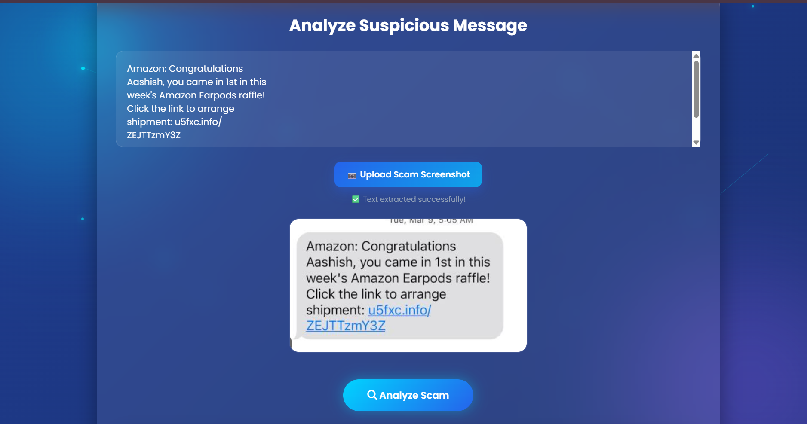
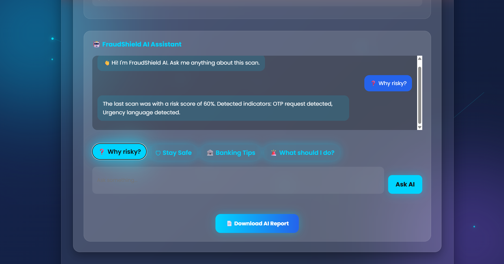

<p align="center">
  
</p>

<h1 align="center"> FraudShield AI</h1>

<p align="center">
AI-powered scam detection platform for SMS, Emails, URLs and Screenshot Analysis.
</p>

<p align="center">
  
  
  
  
</p>

# FraudShield AI

FraudShield AI is an AI-powered scam detection platform that helps users identify phishing messages, fake links, online fraud, and suspicious screenshots.

Built for the **ET AI Hackathon 2026**.

---
## 📂 Project Structure

```text
FraudShield-AI/
│
├── frontend/
│   ├── assets/
│   │   └── logo.png
│   ├── index.html
│   ├── style.css
│   └── script.js
│
├── backend/
│   └── app.py
│
└── README.md
```

## ✨ Features

- ✅ AI Scam Detection
- ✅ SMS Analysis
- ✅ Email Analysis
- ✅ URL Detection
- ✅ OCR Screenshot Analysis
- ✅ PDF Report Generation
- ✅ Scan History
- ✅ AI Assistant

## 📸 Screenshots

### 🏠 Home Page



### 📊 Scam Analysis



### 📷 OCR Screenshot Analysis



### 💬 AI Chatbot




## 🛠️ Technologies Used

### Frontend
- HTML
- CSS
- JavaScript

### Libraries
- Tesseract.js
- jsPDF
- Font Awesome

### Backend
- Planned for future integration (Python/Flask)


## 🚀 How to Run

1. Clone the repository

```bash
git clone https://github.com/manviofficial1212-gif/FraudShield-AI.git
```

2. Open the frontend folder
3. Run using Live Server


## 🔗 Live Demo

👉 **https://fraud-shield-ai-ruby.vercel.app**


## 📌 Future Improvements

- 🤖 Gemini API integration
- 🌐 Multilingual OCR support
- 🔗 Real-time URL scanning
- 🌙 Dark/Light mode
- 📱 Mobile responsiveness

---

## 👩‍💻 Developer

**Manvi Gupta**

**LinkedIn:**  
https://www.linkedin.com/in/manvi-gupta-5a954b37a

**GitHub:**  
https://github.com/manviofficial1212-gif